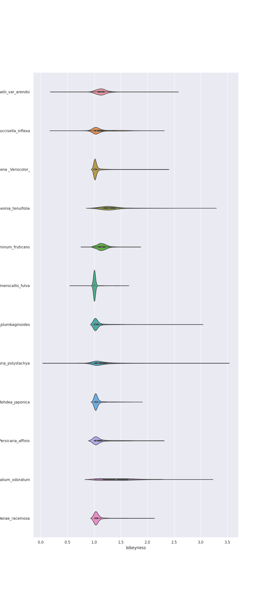
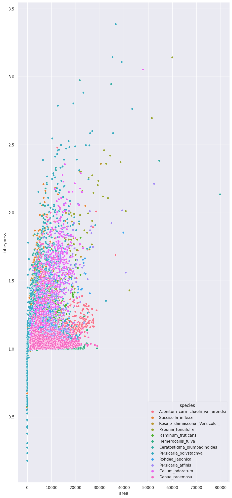
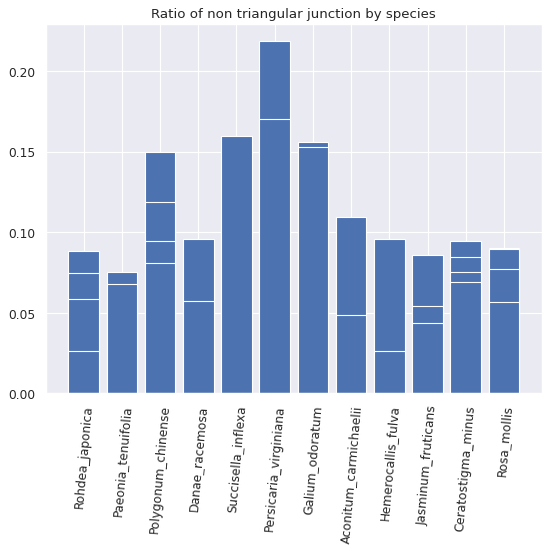

## ANALYSE LEAF EPITHELIUM

JOLLIVET-COURTOIS Chloé, KERBOURC'H Emma, URAZ Peri

## INTRODUCTION 
    

The aim of our project is to study the shape of plant cells, especially leafs, thanks to image analysis. We dispose of a dataset including about 100 microscopic leaf photos (**abaxial or adaxial**) of 26 different plants species.

It’s interesting to study the shape of epithelium cells because there is a link between the shape and function of plant cells. In the article (1), searchers hypothesised that the form that puzzle-shape cells takes is a strategy to reduce mechanical stress in the **cell wall** of the **epidermis**. They supposed that when tissue-level growth is isotropic (meaning they expand in all directions), lobes emerge at the cellular level to reduce cellular stress. They already know that the extent of the stress depends on the shape and size of the cells; for example, large cells bulge out and experience more stress than small cells.
‘paving’ the leaf surface with puzzle shaped cells (instead of more regularly shaped cells) reduces the stress in the epidermal cell walls.
In the part of the plant that grow isotropically, complex puzzle shapes develop, like in leaves. While in the parts of the plant that grows mostly in one direction, long thin cells are sufficient to reduce the stress on the epidermal cell wall, like in a root or stem. In our dataset we have as many complex puzzle shapes than long thin cells

We search to know here 3 things : **how many cells an image present**, **how theses cells are connected** and **how we can infer the cell expansion directions**. Thus we sort our data and create a plugin that is able to segment any epithelium in Napari. And we create a pipeline for each of theses goals.

(1) Vőfély, Róza V. et al. (2019), Data from: Of puzzles and pavements: a quantitative exploration of leaf epidermal cell shape, Dryad, Dataset, https://doi.org/10.5061/dryad.g4q6pv3

### Definitions about plant architecture

* **Abaxial**: The dorsal side of the leaves of a plant is abaxial.
* **Adaxial**: Antonym of abaxial. The upper side of the leaves of a plant is adaxial.
* **Cell wall**: hollow cylinder composed of the globular protein tubulin that constitutes the cytoskeleton.
* **Epidermis**: Layer of tightly packed cells that constitute the external protective layer of the plant.  Its main function is to protect the plant from diseases and water loss.
* **Membrane**: external envelope of the cell made up of phospholipid and protein which constitutes a selective barrier.
* **Turgor pressure**: water pressure inside plant cell that can give rigidity to the leaf. Pressure exerted by osmotic flow of water is called turgidity. 
* **Microtubule**: Filaments of the cytoskeleton involved in major functions such as mitosis or intracellular transport. They are hollow cylinders made of tubulin, which is one of the most abundant proteins in the cell. They are only present in eukaryotes. They have a diameter of about 25 nm and a variable length.
* **Toluidine blue staining**: a blue basic dye used in histologie. It is absorbed by the nucleic acids, and dyes particularly the ARN. So the nucleolus is intensely stained, that’s permit to observe the organization and configuration of the cell (also to permit the counting of cells)

*Sources : https://www.researchgate.net/figure/Adaxial-and-abaxial-leaf-side-of-the-C-betulus-leaf-The-adaxial-leaf-side-usually-faces_fig1_319295106*

*https://www.insb.cnrs.fr/fr/cnrsinfo/les-microtubules-naissent-partir-doligomeres-droits-de-tubuline*

*http://histologyguide.com/slideview/MH-003-toluidine-blue/01-slide-1.html?x=58644&y=29410&z=20.6*

*Campbell Biology, chapter 35, concept 35.1 & Glossary*

## Python dependencies:

**Install Lirairies and modules required to run the code :**

**How to install them ?**

In the Terminal :

- napari

 ---> `pip install "napari[all]"`

- skimage
- numpy
- matplotlib
- pandas

 ---> `pip install scikit-image pandas numpy matplotlib scipy`

- seaborn

 ---> `conda install seaborn`
 

Import the following librairy : (import [librairy name])
- glob
- tifffile

## HOW TO USE ? 
A "how to use" tutorial for each use case of the project

To use this code, replace the pathway (in **All user choise**) for each folder in function of your folder organisation on your computer
Run the three first cells.

**0. Segmentation**

Before starting the questions, the cell images must be segmented. 
We classified these images in 6 groups to apply the correct segmentation.
Each group have a different segmentation apply with its functions, example : segmentation_group1() for the group1 (segmentation_group1.py in the **src folder**). 
The loop (in first cell) permits to apply the segmention for group 1 and put the mask obtained in the folder **mask_result_folder**.
It's the same way for the other groups.

Execute all the cells in Segmentation part. 

### 1. How Many Cells ? [Turorial]

The loop allows to 
    - count the cell number and put in a list
    - list the image names
    - list centroid csv file
and make a table with those three lists.
This table is registered in the **results_how_many_cells** folder (in results folder).

The second step, permits to make one csv file per image that contains a list of centroids of this image. It registered in the **centroids** folder (in results_how_many_cells).

### 2. How Can We Infer The Cell Expansion Directions? [Tutorial]

First cell code calculates the lobeyness of each labeled image of each species and print a dataframe with some parmateres (area, perimeter, convex hull perimeter) with its image names.

Second cell code make a violin plot of the lobeyness in funtion of the species plant (with the previous dataframe)

What we obtained :

Third cell code make a scatter plot of area in function of lobeyness (organized in color per species)

What we obtained:

Fourth cell code permits to compare our previous results (dataframe of first cell) with a parametric map of the mask. (for the image that you want to compare)

### 3. How Are Cells Connected ? [Tutorial]
   
This question requires 3 functions : inverse_label, total_junctions, non_triangular_junction 

**-All theses functions are in src folder**

**-You have to import all the libraries needed**

**-You can find the code in the Projet Bio-informatique_Analyse leaf epithelium notebook.ipynb** notebook.

From the segmentation done for How Many Cell, you get all the mask for each image in only one folder **mask_result_folder**. Make sure you have this folder filled before running the code.

Main steps of the code : 1- it invert the masks in order to obtain the segmentation of the contours and not the cells.
2- it find all junctions and count them. 
3- it determine which are non-triangular (junction of more than 3 cells)

The code permit you to obtain : 
   - one csv file per image containing coordinates of the non triangular junctions
   - a csv table containing all the the number of non triangular junctions and the total number of junctions with csv file name 
   - a figure bar plot showing in x the species and in y the ratio (number of non triagular / number total) value for each image. 

## Main limitations/known issues and future developments

**Limits for the segmentation** : not all the image has an associated segmentation (see more on Database structure below)

**Limits for How can we infer cell expansion directions** : the parametric map colored not-well 

## Database structure

The images of the dataset present different problems : they have different luminosity and sometimes vein or stomates, or the second layer could appear and disrupting the segmentation. We divide our dataset in 5 groups to segment well.

* Group 1 contains image of cells with **linear form** and **puzzle form**  with **vein**

* Group 2 contains image of cells with **linear form** with **vein**

* Group 3 contains image of cells with **linear form** and **puzzle form** with **vein** and **stomate**

* Group 4 contains image of cells with **simple linear form**

* Group 5 contains image of cells with **linear form** and **puzzle form** with **stomate**

Finally,according to the quality and composition of the images we decided to evict some of them because our 5 segmentations did not work on them. You can find them in the folder "not chosen" (/home/criuser/Téléchargements/projet epitelium/Data/FDV_cell_database/not chosen)
